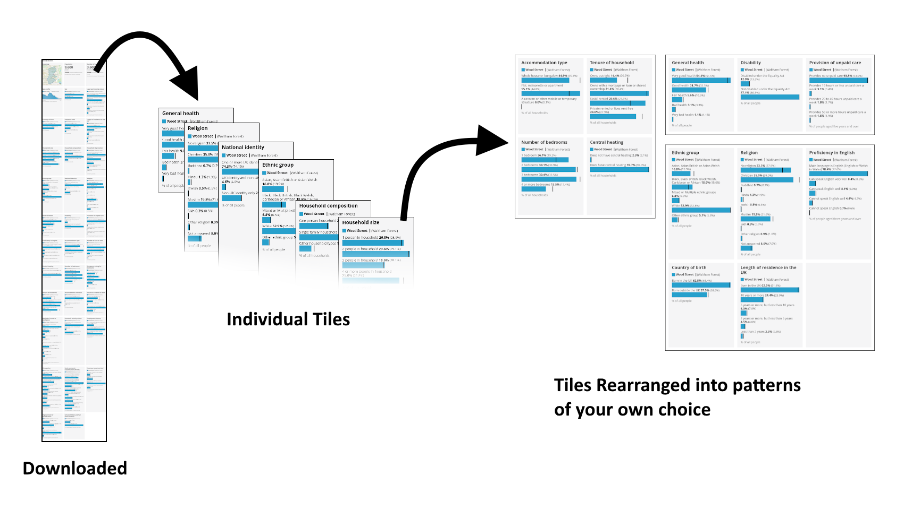
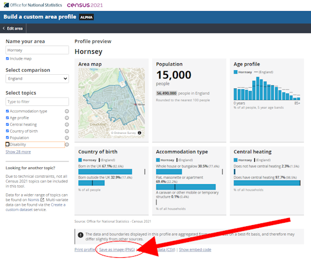

# CustomAreaProfileSplitter
 _ONS Custom Area Profile PNG Splitter and Composer_

An R tool to split PNG chart mosaics produced with the [Census 2021 Custom Area Profile Builder](https://www.ons.gov.uk/visualisations/customprofiles/draw/) into individual chart tiles and rearrange the tiles into patterns of your own choice.

## Input Images

Create your own Area Profile with the [Census 2021 Custom Area Profile Builder](https://www.ons.gov.uk/visualisations/customprofiles/draw/) with all the statistics you require. Download the report as a PNG image. Below is an example for Hornsey, London.

Save the file/s in the **Input** folder

